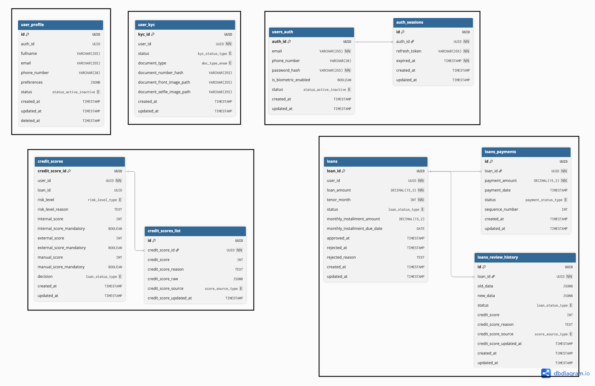

PT. XYZ adalah sebuah perusahaan fintech yang ingin mengembangkan mobile apps mereka, dalam upaya menjangkau pengguna yang lebih luas mereka ingin mengembakan aplikasi pinjaman online.

Potential High Level User Story:
1. User melakukan registrasi dengan data dir,emaili, nomor telepon dan upload foto beserta KTP
2. User dapat login dengan password atau biometric (jika ada di perangkat mobilenya)
3. User dapat melihat Sisa hutang dan tagihan perbulan yang harus di bayarkan (Jika ada)
4. User dapat meminjam uang paling besar Rp. 12.000.000 dengan tenor maksimal 1 taun.
5. User dalam proses peminjaman akan di proses dengan hasil diterima atau ditolak
6. Jika pinjaman diterima maka akan ada notifikasi lewat email dan nomot telepon yang terdaftar
7. User tidak dapat melakukan peminjaman uang jika sedang ada proses peminjaman dan belum di lunaskan.

Tugas Anda:
1. Buatlah high level design architecture atas project mobile apps ini.
     ada document ini
2. Spesifikasikan design Screen Flow dan ERD atas rancangan yang ingin anda buat.
     
3. Buatlah detail design untuk API dengan menggunakan tools design seperti UML,ERD,flowchart,etc.
    
    
    
    
    
    
4. Buatlah detail design untuk screen behavior dari mobile apps berdasarkan screen flow diatas.
    

